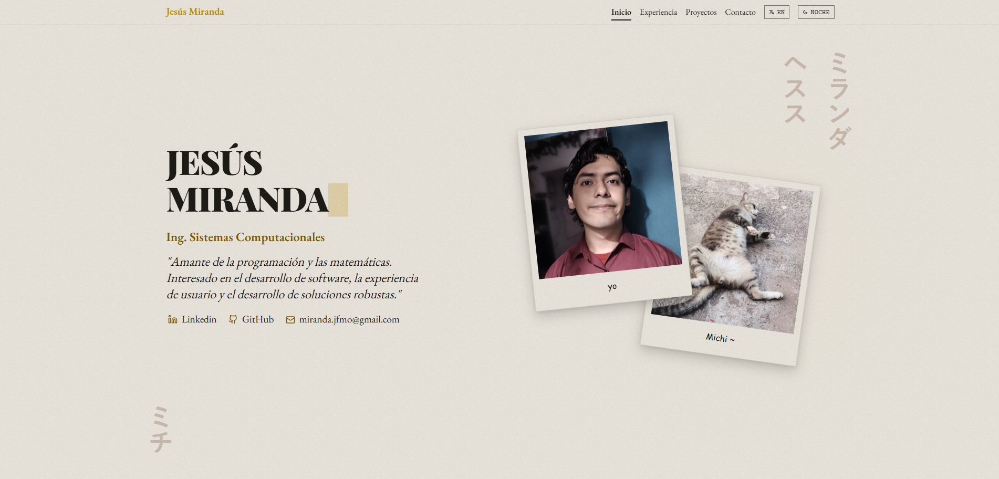

# Portafolio web

Portafolio web personal sobre mi experiencia y proyectos en programación.

**Demo:** [Ver sitio](https://yisusreveck.github.io/portfolio/)

## Capturas



## Tecnologías

- Angular
- Material Design 3
- emailjs

## Características

- Modo claro/oscuro
- Soporte multilenguaje (Inglés/Español)
- Diseño responsive
- Formulario de contacto funcional (EmailJS)
- Sección de proyectos destacados y experiencia profesional con animaciones

## Instalación local

```bash
npm install
ng serve
```

## Licencia

- **Código:** MIT — ver [LICENSE](LICENSE).
- **Contenido de autoría propia, ubicado en `/public/own`:** Todos los derechos reservados.
- **Contenido de autoría propia, ubicado en `/public/cc`:** CC BY-NC-ND 4.0 — ver [texto completo](https://creativecommons.org/licenses/by-nc-nd/4.0/legalcode).
- **Contenido de terceros:** algunos assets provienen de terceros y ese contenido **no** está cubierto por ninguna de las licencias anteriores. Ver [CREDITS.md](CREDITS.md) para el detalle de origen de cada asset.

## Autor

Jesús Miranda | YisusReveck — [LinkedIn](https://www.linkedin.com/in/jesusm147/) · [GitHub](https://github.com/YisusReveck)
